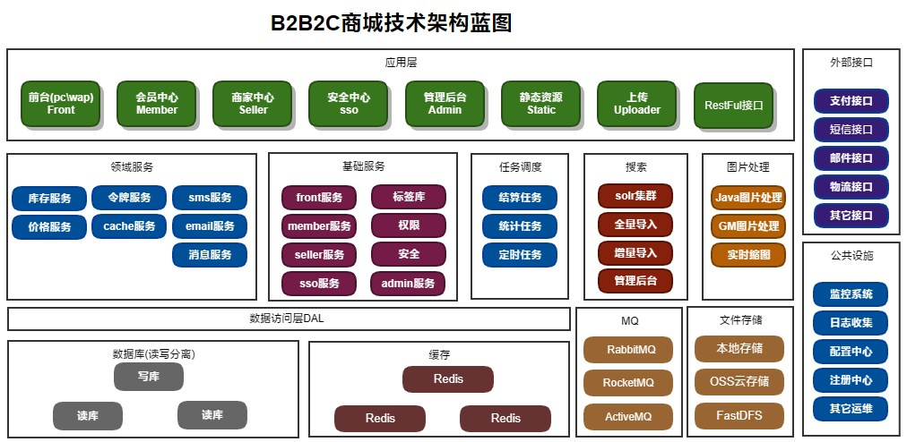

<p align="center">
    <a href="https://www.sicheng.net">
        
    </a>
</p>
<p align="center">
    <a href="https://github.com/oceanbase/oceanbase/blob/master/LICENSE">
        
    </a>
    <a href="https://en.oceanbase.com/docs/community-observer-en-10000000000829617">
        
    </a>
    <a href="https://www.oceanbase.com/docs/oceanbase-database-cn">
        
    </a>
    <a href="https://github.com/oceanbase/oceanbase/actions/workflows/compile.yml">
        
    </a>
</p>

**SiC B2B2C Shop** 是一个B2B2C平台型电商系统，专注于通用电商解决方案。可帮助企业搭建自己的交易平台。交易模式：零售、批发、采购。
# Key features 关键特性

* **AAA** : 待补充。111222
* **AAA** : 待补充。
* **AAA** : 待补充。


# System architecture 系统架构



[Learn More](https://www.sicheng.net)

# Quick start 快速开始

## How to deploy 如何部署

### 🔥 Deploy by all-in-one

你可以使用Docker容器快速部署一套B2B2C电商系统。  
https://hub.docker.com/repositories/sichengtech  DcokerHub镜像仓库列表  
https://hub.docker.com/repository/docker/sichengtech/b2b2c-shop-open/general  shop主程序镜像  
https://hub.docker.com/repository/docker/sichengtech/mysql56/general  MySQL镜像  
https://hub.docker.com/repository/docker/sichengtech/shop-minio/general  Minio对像存储镜像  
https://hub.docker.com/repository/docker/sichengtech/solr-alone/general  solr搜索引擎镜像  

### 🐳 Deploy by docker

1、拉取镜像：
```shell
docker pull sichengtech/mysql56  
docker pull sichengtech/shop-minio  
docker pull sichengtech/solr-alone  
docker pull sichengtech/b2b2c-shop-open  
```

2、创建网络
Docker容器分配静态ip，并使用自定义网络的示例。下面使用一个叫my-net 的自定义网络，使用172.28.0.0/16网段  
创建一个网络172.28.0.0/16  
```shell
docker network create --subnet=172.28.0.0/16 my-net  
```

3、启动镜像
```shell
docker run -d -p 3307:3306 -e MYSQL_ROOT_PASSWORD=123456 --ip 172.28.0.105 --network my-net --name shop-mysql sichengtech/mysql56  
docker run -d -p 9000:9000 -p 9090:9090 --name shop-minio --ip 172.28.0.102 --network my-net sichengtech/shop-minio server /data2 --console-address ":9090"  
docker run -d -p 8983:8983 -t --name shop-solr-alone8 --ip 172.28.0.101 --network my-net sichengtech/solr-alone  
docker run -d -p 8080:8080 --name shop --ip 172.28.0.10 --network my-net sichengtech/b2b2c-shop-open  
```

4、访问
前台：http://localhost:8080/  
会员中心：http://localhost:8080/member/index.htm  
商家后台：http://localhost:8080/seller/index.htm  
管理后台：http://localhost:8080/admin/index.do  
solr搜索引擎后台：http://localhost:8983/solr/#/  
Minio后台：http://localhost:9090/login  


# How to build 如何编译

待补充

# Roadmap 路线图

待补充


# License 许可证

SiC B2B2C Shop 使用 木兰公共许可证,第2版（Mulan PubL v2） 开源协议，请遵守相关条款，或者联系sicheng.net获取商用授权书。

# Community 社区
【社区正在建设中... 】  

中文商城演示站（每天还原数据）：http://demo1.sicheng.net/  
国际商城演示站（每天还原数据）：http://demo2.sicheng.net/  
社区官网（文档、论坛）： http://www.sicheng.net  
商城使用手册： http://www.sicheng.net/shopdoc/  

## 演示账号
### PC商城前台地址与账号
商城首页：http://demo1.sicheng.net

### PC商家后台地址与账号
地址：http://demo1.sicheng.net/seller/index.htm  
用户名：fanxiuxiu3，密码：135886，北京汇鑫科技有限公司   
用户名：jianeng，密码：135886，佳能官方旗舰店  
用户名：meidishop，密码：135886， 美的官方旗舰店  
用户名：zongtian，密码：135886，纵天汽配店  
用户名：qiaopai，密码：135886，壳牌思程自营店  
用户名：guoyang，密码：135886，张加力专卖店  
用户名：xiaoyi，密码：135886， 小蚁（YI）官方旗舰店

### PC会员中心地址与账号
地址：http://demo1.sicheng.net/member/index.htm  
zhang123，密码：135886，个人买家  
admin123，密码：135886，个人买家  
cailong17，密码：135886，个人买家

### PC管理后台地址与账号
地址：http://demo1.sicheng.net/admin/index.do  
thinkgem，密码：135996，超级管理员  
admin，密码：135996，系统管理员买  

111222333444555666777888999111222333